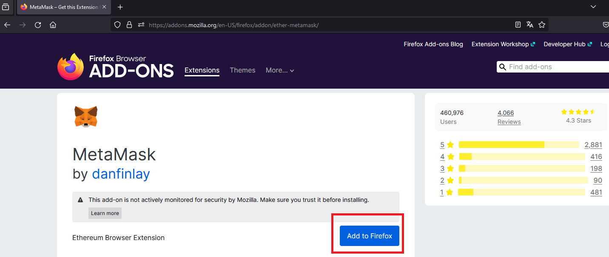

# Blockchain Workshop: Deploying your first Smart Contract

## Introduction
In this workshop, you will learn how to:

* Set up a local blockchain development environment

* Write, deploy, and interact with a smart contract locally

* Deploy your smart contract to a public [Ethereum testnet](https://ethereum.org/ca/developers/docs/networks/#ethereum-testnets)


## Requirements
* Node LTS (v22.16.0)
    > We recommend to install node using the available package managers (`nvm` or `fnm`)
    > https://nodejs.org/en/download/package-manager
* IDE (vscode, Intellij or Notepad)

## 1. Local environment setup

1.1- Clone this GitHub repository

```bash
git clone https://github.com/TheMatrix97/Workshop-Blockchain.git
```

1.2- Install the `npm` dependencies already defined in [./package.json](./package.json)

```bash
npm install
```

1.3- Initialize a new [HardHat](https://hardhat.org/) config file

> Hardhat is a development environment for SmartContracts and dApps for Ethereum

```bash
npx hardhat init
```
**Important:** Select the option to create and empty `hardhat.config.js`, we won't need an example project...

## 2. Write and compile the Smart Contract

2.1- Write the `Box` contract and save the content into `contracts/Box.sol`

```sol
// SPDX-License-Identifier: MIT
pragma solidity ^0.8.0;

contract Box {
    uint256 private _value;

    event ValueChanged(uint256 value);

    function store(uint256 value) public {
        require(value > 0, "Value must be greater than 0");
        _value = value;
        emit ValueChanged(value);
    }

    function retrieve() public view returns (uint256) {
        return _value;
    }
}
```
:pencil: P1- Try to understand what the contract does. Can you explain it?

:pencil: P2- Why do you think is important to validate inputs (e.g `value > 0`)

2.2- Compile the smart contract

```bash
npx hardhat compile
```

## 3. Deploy locally
3.1- First, start a local Ethereum Node for debugging

```bash
npx hardhat node
```
> Keep in mind this command will block the shell. **Don't close the terminal** as the local node has no persistance!

3.2- Write the deployment script. Save the following content into `scripts/deploy.js`

```js
// scripts/deploy.js
async function main () {
  // We get the contract to deploy
  const Box = await ethers.getContractFactory('Box');
  console.log('Deploying Box...');
  // Deploy the contract
  const box = await Box.deploy();
  await box.waitForDeployment();
  console.log('Box deployed to:', await box.getAddress());
}

main()
  .then(() => process.exit(0))
  .catch(error => {
    console.error(error);
    process.exit(1);
  });
```
3.3- Don't forget to include the `ethers` library import in our `hardhat.config.js` file

```js
/** @type import('hardhat/config').HardhatUserConfig */
require('@nomicfoundation/hardhat-ethers');
module.exports = {
  solidity: "0.8.28",
};
```
3.4- Deploy the contract to the local blockchain instance

```bash
npx hardhat run --network localhost scripts/deploy.js
```
> Take note of the contract address returned

## 4. Interact with the Smart Contract

At this point, the Smart Contract is already deployed in our local blockchain instance. Let's try to invoke their functions...

4.1- Open a local hardhat console

```bash
npx hardhat console --network localhost
```

4.2- Use the `ethers` library to obtain the contract reference and call the `.store()` function. 

```js
const Box = await ethers.getContractFactory('Box');
const box = Box.attach('CONTRACT_ADDRESS'); // Replace with your contract address
await box.store(33); // Store a value
```

4.3- Now, retrieve the value stored in the Box. Does it work?

```js
console.log(await box.retrieve()); // Retrieve the value
```

4.4- Retrieve the last Block appended to the Blockchain

```js
const latestBlock = await ethers.provider.getBlock('latest');
console.log(latestBlock);
```

:pencil: P3- Write down the block parameters you obtained.

:pencil: P4- Explain what Gas is and why transactions in Ethereum consume Gas. Which type of attack does it help to mitigate?

## 5. Deploy to a public Testnet

We are ready to deploy our contract to a public testnet. Those are networks that operate similar to main Ethereum network, but Ether has no value and is free no acquire, making them ideal for testing our contract in a real environment at no cost.

To deploy contracts, we need to use an Ethereum node as gateway. In this workshop, we are using a third-party node from [Alchemy](https://www.alchemy.com/). The usage of these nodes incurs some fee, but we will take advantage of the free tier.

First, let's create the wallet we will use to deploy the contract with [Metamask](https://metamask.io/es/).

5.1- Open a browser and install the official `Metamask` extension. As for example, in Firefox (https://addons.mozilla.org/en-US/firefox/addon/ether-metamask/)



5.2- Now, configure a new wallet and set a secure password


5.3- Don't forget to set a Secret Recovery Phrase and take note of the 12-word phrase. We will use this information in the next steps


5.4- At this point, our wallet should already be configured. Select the `Sepolia` testnet, where we will deploy our contract.


5.5- As you might already know, deploying contracts into the blockchain is not free. Gas is the fee required to successfully conduct a transaction or execute a contract on Ethereum, which is paid with gwei (10^-9 ETH). We will use a `faucet` to send `SepoliaEth` to our wallet.

5.5.1- Get the address of your wallet


5.5.2- Call the Google `faucet` to receive `SepoliaEth`. Google will ask you to login to verify you are a real user. Do not use your `@estudiantat.upc.edu` account

(https://cloud.google.com/application/web3/faucet/ethereum/sepolia)

5.5.3- Verify you have `0.005 Sepolia Eth` in your wallet

5.6- We are closer to deploy our contract! Now, create a `secrets.json` file to store the `Secret Phrase` of our wallet and the `Alchemy` node API Key (*the lecturer will provide this value*)

```json
{
	"mnemonic": "patata naruto goku ...",
	"alchemyApiKey": "Argthy..."
}
```

5.7- Modify your `hardhat.config.js` to include the sepolia network configuration, using the `secrets` defined before

```js
// hardhat.config.js
...
const { alchemyApiKey, mnemonic } = require('./secrets.json');
...
  module.exports = {
    networks: {
     sepolia: {
       url: `https://eth-sepolia.g.alchemy.com/v2/${alchemyApiKey}`,
       accounts: { mnemonic: mnemonic },
     },
     ...
   },
```
5.8- Deploy the Smart Contract to `Sepolia`

> Check the cost of deploying your contract before deploying!

```bash
npx hardhat run --network  sepolia scripts/estimate-cost.js
```

```bash
npx hardhat run --network sepolia scripts/deploy.js
```

> Save the contract address!

## 6. Etherscan
At this point, we will take a look into the state of the blockchain using Etherscan (https://sepolia.etherscan.io/)

6.1- Search your contract transaction


> As you might see, the contract is stored in bytecode, which makes difficult to users to understand the code behind. To solve that, we can verify the contract and include the source code.

6.2- Select the option `Contract > Verify and publish` to include the source code of the contract.

> Don't forget to include the code and set the EVM Target to `paris`


:pencil: P5- Include the contract address in the Lab report

## 7. Interact with the Smart Contract

Let's interact with the contract using Etherscan and MetaMask! Using Etherscan, open your contract page in the browser where MetaMask is installed.

7.1- Navigate to `Contract > Write Contract` and `Connect to Web3`, to connect Etherscan with Metamask. Now, run the `store` function to register a given value 


:pencil: P6- How much `SepoliaEth` will the transaction cost? Explain how transaction cost is computed

:pencil: P7- Is the transaction persisted immediately? Why? Explain the consensus protocol currently used in Ethereum networks.

7.2- Run the contract's retrieve function you will find in `Read Contract` section. Does it return the same value you wrote before?

:pencil: P8- Retrieve the transaction information associated to the `Store` function call. Also, write down the information of the block where the transaction is registered. Add some screenshots to the report

:pencil: P9- Do you think 51% attacks are possible in Ethereum mainnet today? Justify your answer.

# References
* https://docs.openzeppelin.com/learn/developing-smart-contracts
* https://ethereum.org/ca/developers/docs/consensus-mechanisms/pos/